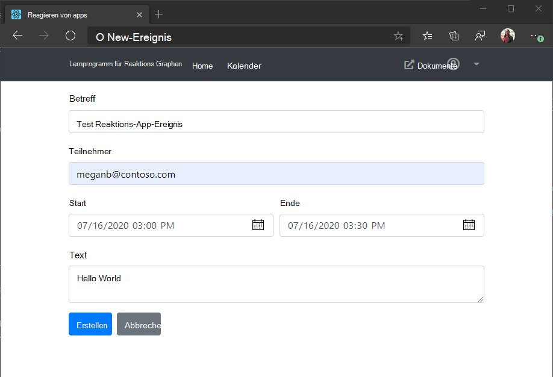

<!-- markdownlint-disable MD002 MD041 -->

In diesem Abschnitt können Sie die Möglichkeit zum Erstellen von Ereignissen im Kalender des Benutzers hinzufügen.

## <a name="add-method-to-graphservice"></a>Add-Methode zu GraphService

1. Öffnen Sie **/src/GraphService.TS** , und fügen Sie die folgende Funktion hinzu, um ein neues Ereignis zu erstellen.

    :::code language="typescript" source="../demo/graph-tutorial/src/GraphService.ts" id="createEventSnippet":::

## <a name="create-new-event-form"></a>Erstellen eines neuen Ereignis Formulars

1. Erstellen Sie eine neue Datei im **./src** -Verzeichnis mit dem Namen "New **Event. TSX.** ", und fügen Sie den folgenden Code hinzu.

    :::code language="typescript" source="../demo/graph-tutorial/src/NewEvent.tsx" id="NewEventSnippet":::

1. Öffnen Sie **/src/app.TSX** , und fügen Sie die folgende `import` Anweisung am Anfang der Datei hinzu.

    ```typescript
    import NewEvent from './NewEvent';
    ```

1. Fügen Sie dem neuen Ereignis Formular eine neue Route hinzu. Fügen Sie den folgenden Code direkt nach den anderen `Route` Elementen hinzu.

    ```typescript
    <Route exact path="/newevent"
      render={(props) =>
        this.props.isAuthenticated ?
          <NewEvent {...props} /> :
          <Redirect to="/" />
      } />
    ```

    Die vollständige `return` Anweisung sollte nun wie folgt aussehen.

    :::code language="typescript" source="../demo/graph-tutorial/src/App.tsx" id="renderSnippet" highlight="23-28":::

1. Aktualisieren Sie die APP, und navigieren Sie zur Kalenderansicht. Klicken Sie auf die Schaltfläche **Neues Ereignis** . Füllen Sie die Felder aus, und klicken Sie auf **Erstellen**.

    
